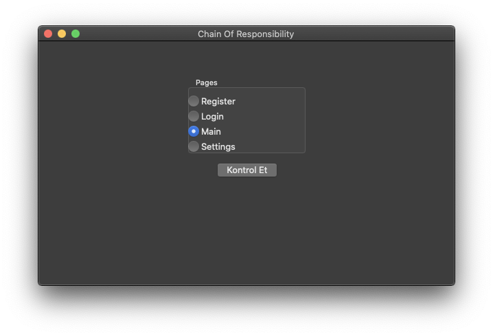
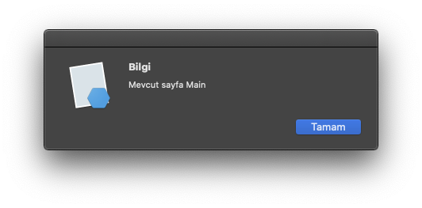

== [underline]#Chain Of Responsibility#

=== Tanım:
* Yapılacak işlemi birden fazla sınıf arasından hangisinin gerçekleştireceğine karar verir.
* Amacı aynı görevi üstlenen nesnelerin birbirinden en az miktarda haberdar olmasıdır. (Lose Coupled - Gevşek Bağlı)

=== Örnek

Verilen enum tipindeki değerin hangi sayfayı temsil ettiğini bulan bir uygulama.

=== UML:
[uml,file="chain-uml.png"]
--
@startuml
abstract class Handler {
    # successor : Handler
    + {abstract} check(type:PageType)
    + succeedWith(successor:Handler)
    + next(type:PageType)
}
class RegisterHandler {
    + check(type:PageType)
}
class LoginHandler {
    + check(type:PageType)
}
class MainHandler {
    + check(type:PageType)
}
class SettingsHandler {
    + check(type:PageType)
}
enum PageType {
    RegisterPage
    LoginPage
    MainPage
    SettingsPage
}
Handler <|-- RegisterHandler
Handler <|-- LoginHandler
Handler <|-- MainHandler
Handler <|-- SettingsHandler
Handler --o Handler: successor
@enduml
--

=== Neden Kullandım?

* Ayarlar ekranına ulaşmak isteyen bir kullanıcı sırasıyla Register, Login, Main sayfalarını ziyaret etmesi gerekir.
* if else kontrolü yapmak yerine handler'ları sırasıyla birbirine bağlayarak nesnelerin birbirinden bağımsız olarak kontrol işlemlerini yapmasını sağladım.

=== Kod:

[source,csharp]
----
public abstract class Handler
{
    protected Handler successor; // <1>

    public abstract void check(PageType type); // <2>

    public void succeedWith(Handler successor) // <3>
    {
        this.successor = successor;
    }

    public void next(PageType type) // <4>
    {
        if(successor != null)
        {
            successor.check(type);
        }
    }
}
----

<1> Kendinden sonraki gelecek olan sayfayı tutan değişken, miras yolu ile kullanılır.
<2> Her bir sayfanın miras yolu ile tanımladığı metod. Condition işlemi bunun içerisinde gerçekleşir.
<3> Bir sonraki sayfayı bu metod ile tutar.
<4> Bir sonraki sayfaya geçiş işlemi için bu metod kullanılır. successor'a atama işlemi yapılmışsa check metodu çağrılır.

[source,csharp]
----
public class RegisterHandler: Handler
{
    public override void check(PageType type)
    {
        if (type == PageType.RegisterPage) // <1>
            MessageBox.Show("Mevcut sayfa Register", "Bilgi");
        else
            next(type); // <2>
    }
}

public class LoginHandler : Handler
{
    public override void check(PageType type)
    {
        if (type == PageType.LoginPage) // <1>
            MessageBox.Show("Mevcut sayfa Login", "Bilgi");
        else
            next(type); // <2>
    }
}

public class MainHandler : Handler
{
    public override void check(PageType type)
    {
        if (type == PageType.MainPage) // <1>
            MessageBox.Show("Mevcut sayfa Main", "Bilgi");
        else
            next(type); // <2>
    }
}

public class SettingsHandler : Handler
{
    public override void check(PageType type)
    {
        if (type == PageType.SettingsPage) // <1>
            MessageBox.Show("Mevcut sayfa Settings", "Bilgi");
        else
            next(type); // <2>
    }
}

----

<1> Sayfaların check metoduna gelen enum type değeri kendisini temsil ediyorsa ekrana mevcut sayfanın ismi yazıdırılır.
<2> Kendisini temsil etmiyorsa bir sonraki sayfa aynı type değeri ile birlikte çağırılır.

[source,csharp]
----
private PageType state = ...

public void Main()
{
    RegisterHandler register = new RegisterHandler(); // <1>
    LoginHandler login = new LoginHandler();
    MainHandler main = new MainHandler();
    SettingsHandler settings = new SettingsHandler();

    register.succeedWith(login); // <2>
    login.succeedWith(main);
    main.succeedWith(settings);

    register.check(state); // <3>
}

public enum PageType
{
    RegisterPage,
    LoginPage,
    MainPage,
    SettingsPage
}
----

<1> Sayfaların tanımlamaları yapılır.
<2> Her bir sayfanın ardından gelecek olan sayfayı gösterilir. 
Sonraki gelecek olan handler'ı ekleme işlemi.
<3> Kontrol edilmesi istenen sayfanın enum tipi ilk sayfanın Handler abstract sınıfından kalıtılmış olan check metoduna verilir.

=== Ekran Görüntüsü 

